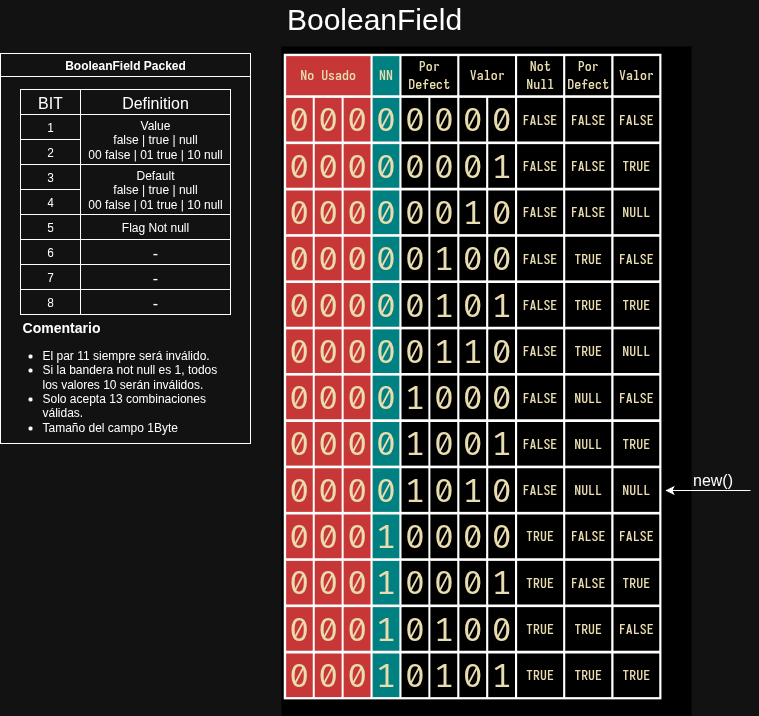

# BooleanField DOD

[](https://crates.io/crates/booleanfield)
[](https://docs.rs/booleanfield)
[](https://opensource.org/licenses/MIT)

**Español** | [English](README.md)

---

`BooleanField` es una implementación eficiente de un campo booleano para Rust que utiliza empaquetamiento de bits para optimizar el uso de memoria. Este diseño permite almacenar no solo el valor booleano, sino también sus restricciones y valores por defecto en un solo byte.

## Tabla de Contenidos

- [Características](#características)
- [Instalación](#instalación)
- [Uso](#uso)
- [Documentación](#documentación)
- [Contribución](#contribución)
- [Licencia](#licencia)

## Diagrama



## Características

- 🚀 **Eficiente**: Usa solo 1 byte de memoria
- 🔒 **Seguro**: Validación de datos integrada
- 🧩 **Extensible**: Fácil de integrar con otros sistemas
- 📦 **Ligero**: Sin dependencias externas

## Instalación

Agrega la siguiente línea a tu archivo `Cargo.toml`:

```toml
[dependencies]
booleanfield = "0.1.0"  # Verifica la versión más reciente en crates.io
```

## Uso

Aquí tienes un ejemplo básico de cómo usar `BooleanField`:

```rust
use booleanfield::BooleanField;

fn main() {
    // Crear un campo con restricción NOT NULL y valor por defecto
    let field = BooleanField::<&str>::new()
        .not_null()
        .default(true);

    // El campo autovalida el valor
    let mut field_with_value = field;
    assert!(field_with_value.set_value(None).is_err()); // Intenta asignar NULL, lo cual falla

    // El campo genera su definición SQL de forma dinámica
    println!("{}", field.to_sql());
    // Salida: BOOLEAN NOT NULL DEFAULT TRUE
}
```

## Contribución

¡Las contribuciones son bienvenidas! Si encuentras algún error o tienes sugerencias para mejorar este proyecto, por favor abre un issue o envía un pull request.

## Documentación

### Descripción del Diseño

El `BooleanField` es una solución optimizada para la gestión de campos booleanos en bases de datos. A diferencia de las implementaciones estándar que suelen asignar un byte completo para un valor booleano (`true`, `false`, `NULL`), este diseño utiliza una codificación de bits para empaquetar de manera eficiente el valor, las restricciones de integridad y las propiedades por defecto en un solo byte.

El diseño se basa en un conjunto de **13 estados válidos** que representan todas las combinaciones posibles de valor (`true`, `false`, `NULL`), restricción (`NOT NULL`) y valor por defecto. La estructura de datos garantiza que cualquier valor fuera de estas combinaciones sea considerado inválido, lo que refuerza la integridad del dato a nivel fundamental.

### Justificación

Este código es el resultado de la puesta en práctica de mi camino de aprendizaje del lenguaje Rust, que reconozco que aún son superficiales. Me imagino que a medida que vaya avanzando, iré mejorando la implementación del código aquí publicado.

### Principios de Ingeniería

Este `BooleanField` destaca por aplicar principios de diseño robustos y modernos:

#### 1\. Eficiencia de Memoria y Empaquetamiento de Bits

El núcleo del diseño reside en la estructura `PackedBooleanData`, que utiliza un tipo primitivo `u8` (8 bits) para almacenar toda la información del campo. Esto elimina el desperdicio de los 7 bits que a menudo no se utilizan en implementaciones tradicionales. El espacio ganado no solo se usa para el valor (`true`, `false`), sino también para codificar el estado `NULL` y las propiedades `NOT NULL` y `default`.

#### 2\. Integridad por Diseño: El ADN Autoconsciente del Dato

La validación no es un proceso externo; es una propiedad inherente al dato. Las funciones `encode_state` y `decode_state` actúan como guardianes, permitiendo solo que los 13 estados válidos sean representados. Esto asegura que los datos sean siempre coherentes y evita la corrupción desde la capa de entrada. Si un valor inválido se introduce en la base de datos, la función de decodificación lo detectará y rechazará al intentar leerlo.

El campo es "autoconsciente" porque **lleva consigo su propia definición de lo que es válido**. Su "ADN" es la firma de bits que determina su identidad y garantiza que su valor nunca pueda contradecir su propia naturaleza. La validación se convierte en un acto intrínseco de lectura y escritura.

#### 3\. Separación de Responsabilidades

El diseño separa de forma limpia las responsabilidades en diferentes componentes, siguiendo el principio de la separación de intereses:

PackedBooleanData y BooleanOps se encargan de la lógica de bajo nivel, las operaciones de empaquetamiento de bits y las operaciones lógicas, optimizadas para el rendimiento.

BooleanDisplayConfig y BooleanDisplay gestionan la presentación y visualización del campo, permitiendo a los desarrolladores personalizar la salida ("true", "false", "Sí", "No") sin afectar la lógica de almacenamiento.

BooleanField es la interfaz de alto nivel que une todas las partes, ofreciendo una API intuitiva y legible.

Esta arquitectura evita que el código se vuelva monolítico, haciendo que sea más fácil de leer, mantener y extender.

## Licencia

Este proyecto está licenciado bajo la [Licencia MIT](LICENSE) - ver el archivo [LICENSE](LICENSE) para más detalles.

---

Desarrollado con ❤️ por maljos

Este diseño no solo aborda la eficiencia de la memoria, sino que también ofrece un modelo robusto y seguro para la gestión de datos booleanos, lo que lo convierte en un componente valioso para cualquier biblioteca de base de datos o framework.

## ¿Qué sigue?

Actualmente estoy trabajando en implementar un tipo `DateField` eficiente siguiendo principios de diseño similares. Si este proyecto te resulta útil y te gustaría apoyar mi trabajo, considera [invitarme un café](https://paypal.me/veo360?country.x=VE&locale.x=es_XC). ¡Tu apoyo me ayuda a seguir desarrollando bibliotecas de Rust de alta calidad!
