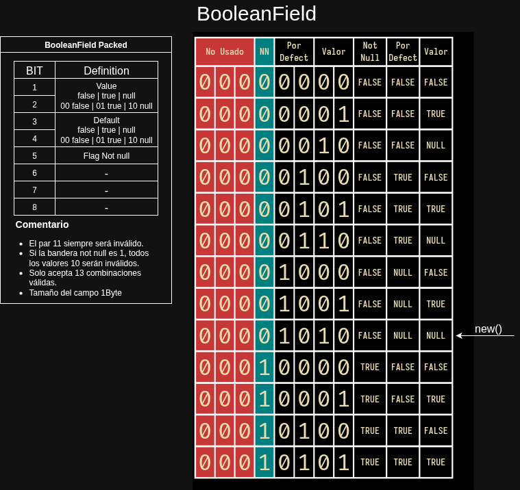

# BooleanField DOD

[](https://crates.io/crates/booleanfield)
[](https://docs.rs/booleanfield)
[](https://opensource.org/licenses/MIT)

`BooleanField` is an efficient boolean field implementation for Rust that uses bit-packing to optimize memory usage. This design allows storing not just the boolean value, but also its constraints and default values in a single byte.

[Español](README.es.md) | **English**

## Table of Contents

- [Features](#features)
- [Installation](#installation)
- [Usage](#usage)
- [Documentation](#documentation)
- [Contributing](#contributing)
- [License](#license)

## Diagram



## Features

- 🚀 **Efficient**: Uses only 1 byte of memory
- 🔒 **Safe**: Built-in data validation
- 🧩 **Extensible**: Easy to integrate with other systems
- 📦 **Lightweight**: No external dependencies

## Installation

Add the following to your `Cargo.toml`:

```toml
[dependencies]
booleanfield = "0.1.0"  # Check the latest version on crates.io
```

## Usage

Here's a basic example of how to use `BooleanField`:

```rust
use booleanfield::BooleanField;

fn main() {
    // Create a field with NOT NULL constraint and default value
    let field = BooleanField::<&str>::new()
        .not_null()
        .default(true);

    // The field self-validates its value
    let mut field_with_value = field;
    assert!(field_with_value.set_value(None).is_err()); // Try to set NULL, which fails

    // The field generates its SQL definition dynamically
    println!("{}", field.to_sql());
    // Output: BOOLEAN NOT NULL DEFAULT TRUE
}
```

## Contributing

Contributions are welcome! If you find any issues or have suggestions for improvements, please open an issue or submit a pull request.

## Documentation

### Design Description

`BooleanField` is an optimized solution for managing boolean fields in databases. Unlike standard implementations that typically allocate a full byte for a boolean value (`true`, `false`, `NULL`), this design uses bit encoding to efficiently pack the value, integrity constraints, and default properties into a single byte.

The design is based on a set of **13 valid states** representing all possible combinations of value (`true`, `false`, `NULL`), constraint (`NOT NULL`), and default value. The data structure ensures that any value outside these combinations is considered invalid, reinforcing data integrity at a fundamental level.

### Engineering Principles

This `BooleanField` stands out by applying robust and modern design principles:

#### 1. Memory Efficiency and Bit Packing

The core of the design lies in the `PackedBooleanData` structure, which uses a primitive `u8` type (8 bits) to store all field information. This eliminates the waste of the 7 bits that often go unused in traditional implementations. The saved space is used not only for the value (`true`, `false`) but also to encode the `NULL` state and the `NOT NULL` and `default` properties.

#### 2. Design Integrity: The Self-Aware DNA of Data

Validation is not an external process; it's an inherent property of the data. The `encode_state` and `decode_state` functions act as gatekeepers, allowing only the 13 valid states to be represented. This ensures that data remains consistent and prevents corruption at the input layer. If an invalid value is introduced into the database, the decoding function will detect and reject it when attempting to read it.

The field is "self-aware" because it **carries its own definition of what is valid**. Its "DNA" is the bit signature that determines its identity and ensures its value can never contradict its own nature. Validation becomes an intrinsic act of reading and writing.

#### 3. Separation of Concerns

The design cleanly separates responsibilities into different components, following the principle of separation of concerns:

- `PackedBooleanData` and `BooleanOps` handle low-level logic, bit-packing operations, and logical operations, optimized for performance.
- `BooleanDisplayConfig` and `BooleanDisplay` manage presentation and visualization of the field, allowing developers to customize output ("true", "false", "Sí", "No") without affecting storage logic.
- `BooleanField` is the high-level interface that ties everything together, offering an intuitive and readable API.

This architecture prevents the code from becoming monolithic, making it easier to read, maintain, and extend.

## License

This project is licensed under the [MIT License](LICENSE) - see the [LICENSE](LICENSE) file for details.

---

Developed with ❤️ by maljos

This design not only addresses memory efficiency but also provides a robust and secure model for boolean data management, making it a valuable component for any database library or framework.

## What's Next?

I'm currently working on implementing an efficient `DateField` type following similar design principles. If you find this project useful and would like to support my work, consider [buying me a coffee](https://paypal.me/veo360?country.x=VE&locale.x=es_XC). Your support helps me continue developing high-quality Rust libraries!
